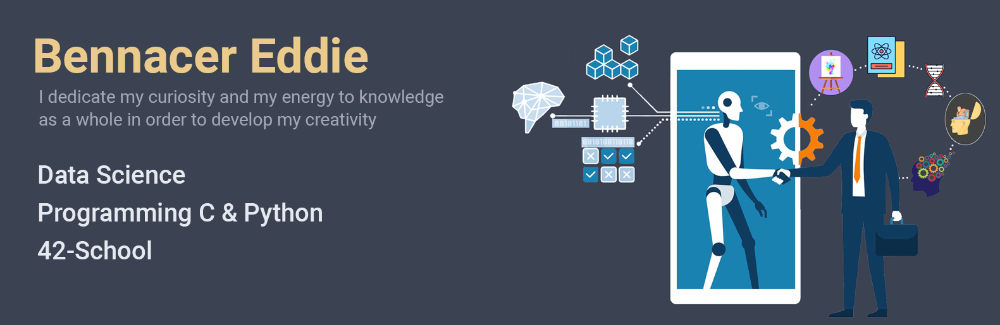

Autodidact in machine learning.

Computer science student at 42 School, programming in C and C++.

This Github gathers all my works, exercises, and my progress.

# Data Science
-  [Transformer from scratch](https://github.com/widium/Transformer)
-  [Neural Style Transfer](https://github.com/widium/Neural-Style-Transfer)
-  [Mildew CLassifier using CNN](https://github.com/widium/Mildew_Classifier)
-  [Deep Reinforcement Learning Push_swap](https://github.com/widium/RL_push_swap)

--
# 42 Cursus
-  [Libft](https://github.com/widium/libft)
-  [Get_next_line](https://github.com/widium/get_next_line)
-  [ft_printf](https://github.com/widium/printf)
---
-  [Push swap](https://github.com/widium/push_swap)
-  [Big O Notation Push Swap](https://github.com/widium/big_O_notations_push_swap)
-  [Fractol](https://github.com/widium/fractol)
-  [Pipex](https://github.com/widium/pipex)
-  [Exam Printf/Get_next_line](https://github.com/widium/exam_00)
---
-  [Minishell](https://github.com/widium/Minishell)
-  [Philosopher](https://github.com/widium/Philosopher)
---
